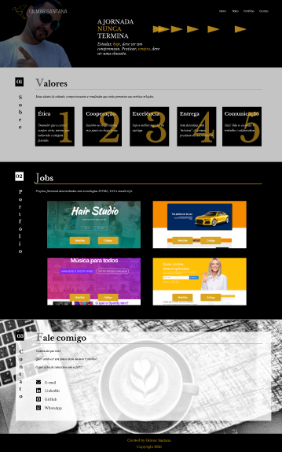
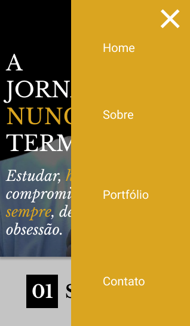

# novoBw

&nbsp;

# About The Project

http://www.gilmarsantana.com/

This is a official website of Gilmar Santana.
This project was buil with b&w conceptions and many effects in hover status changing the element to color mode.

&nbsp;

## Layout Project

The frontend prototype was build at figma platform showing different views, in desktop with max-width: 1800px, and mobile with min-width 320px.

[Figma project](https://www.figma.com/file/7ZL1ASFYD2Q9uu11MngKQ4/Gilmar-WebSite?node-id=0%3A1)

&nbsp;

## Layout Desktop

&nbsp;

## Layout Mobile

&nbsp;

## Layout Mobile

## Technologies

### HTML

Semantic HTML

### CSS

Style in elements, FlexBox layout, KeyFrames, Transition, Position.

### JS

Smooth scroll with JS using cferdinandi smooth-scroll CDN
https://github.com/cferdinandi/smooth-scroll

&nbsp;

&nbsp;

&nbsp;

# Autor

Gilmar Ribeiro Santana

https://www.linkedin.com/in/gilmarribeirosantana/
